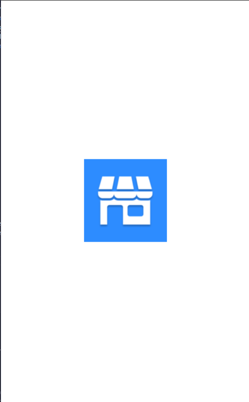
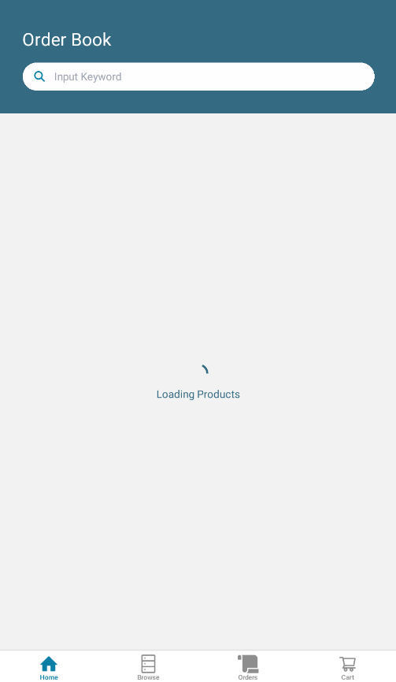
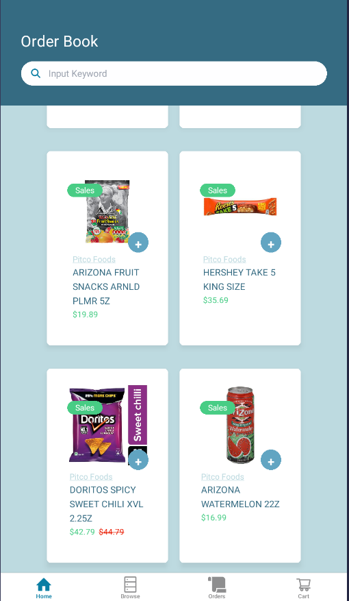
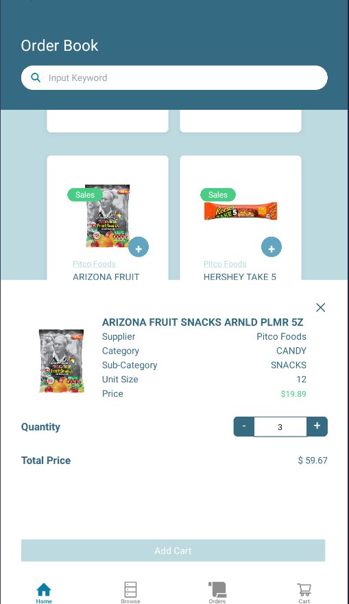
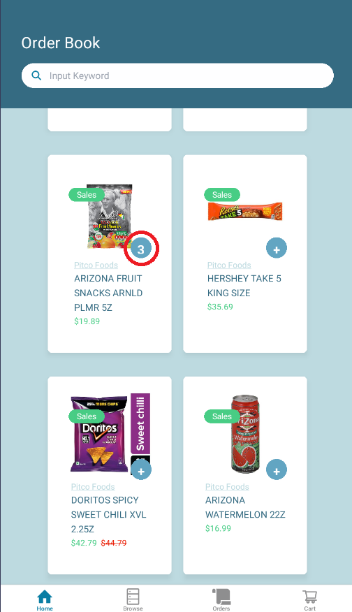
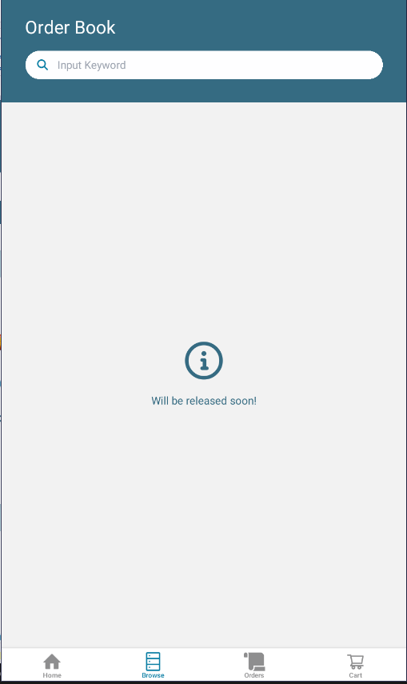
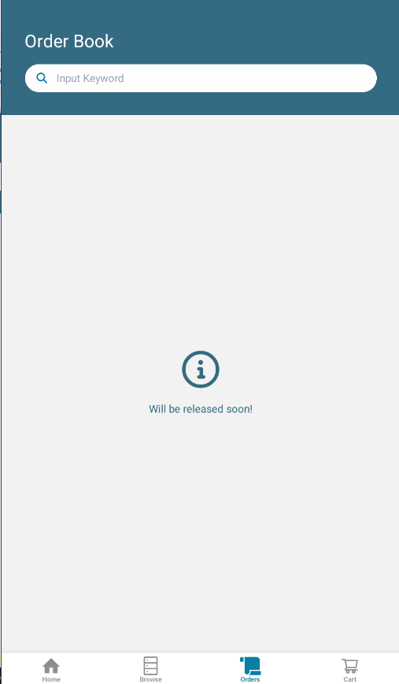
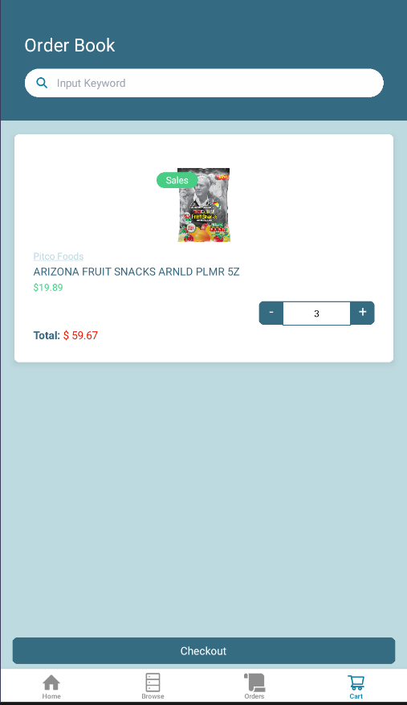
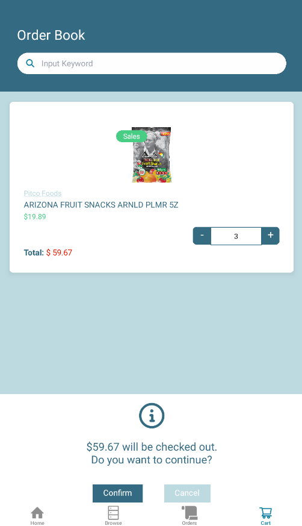

# Order App

## Requirements

Build an order book. At Attain, we build software for distributors. An order book is what stores use to buy inventory from their distributors.
UI should looks similar to [this](https://lh7-rt.googleusercontent.com/docsz/AD_4nXcUvNrYW917l12MRaHsqpEQV1gWXfJTfdp-OrxF8hGPehcfQQjMCMz6hdl-qR_P5kolJMI5H_YKnVm_dXfIQBSPM_mSPK7-JDdTiR-fuP8iZ5ThE54PIZkUpdoxO9vTplpihrYt?key=1HiZrqwiJ5rCGWLjaJQZlot-)

- Order Book should fetch the product data from the [API](https://retoolapi.dev/f0ee0v/items)
- Shoud place a Header component with Searchbar.
- On the page, should render the product information following the given design.
- When user clicks the `+` button on the ProductCard, should put the product in the Cart.
- Should implement cart management logic.

## Tech-Stacks

- React Native
- [Expo](https://expo.dev)
- Typescript
- TailwindCSS/Nativewind
  - _Advantages:_
    - Provide consistent styling across the application rather than using StyleSheet object.
    - Powerful Customization.
    - Reusability.
- React Query/Tanstack
  - _Advantages:_
    - Better state management on both client/server side.
    - Automatic state management of API integration.
- MobX
  - _Advantages:_
    - Easy setup without any boilerplate.
    - Easy to use and implement logic.
- Lint / Prettier / Husky

## Project Structure

- `/app`: Includes the source files of the pages. Implemented the folder-structure based routing.
- `/component`: Includes the custom components across the application.
- `/assets`: Includes the assets of the application. Included fonts and images for the application here.
- `/services`: Includes the helper functions that interacts with APIs.
- `/store`: State management with MobX.
- `/Types`: Common type definition here.

## Dev-Platform

Developed on Android SDK 15.

## Implemented features

- Implemented all of the requirements.
- Implemented `Cart` page with draft checkout functionality.
- Added some more information on the ProductDetailModal.
- Added `CheckoutConfirmationModal` for asking the user's confirmation before checkout.
- Implemented TailwindCSS/Nativewind for styling.
- Added debouncing and memoization for performance improvements.

## Possible Improvements

- Integrate the custom fonts following the given design.
- Implement User management and keeping the cart information for each users.
- Implement better animation for UX.
- Implement `Browse` and `Orders` View.
- Implement exact `Checkout` functionality.

## Setup Guide

- Cloning the repository
  Should clone the repository [here](https://github.com/edwardliu92/Order_App)
- Setup the Runtime Environment
  - Follow [this](https://docs.expo.dev/get-started/set-up-your-environment/) instruction to setup the dev environment.
  - Recommended dev platform: Target Android platform on Windows OS.
  - Setup Node v20 and Yarn package manager.
  ```shell
     npm install -g yarn
  ```
- Run the App.
  - Running the IOS App
  ```shell
     npx yarn run ios
  ```
  - Running the Android App _Prefered_
  ```shell
     npx yarn run android
  ```
  - Running the Web App
  ```shell
     npx yarn run web
  ```
  - Running the Expo Daemon and follow the give instruction
    You can run the Expo Daemon by running `npx yarn start` and follow the instruction there to open the application.

## Screenshots

- 
- 
- 
- 
- 
- 
- 
- 
- 
